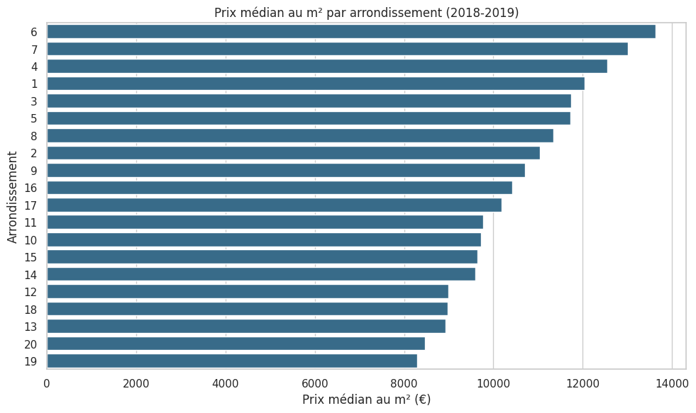
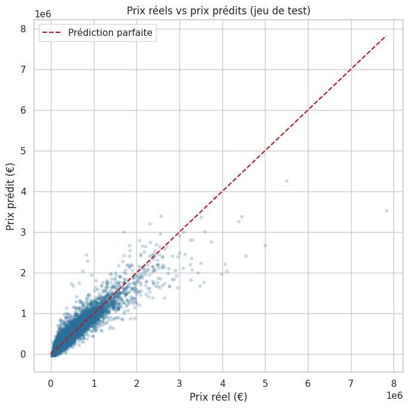
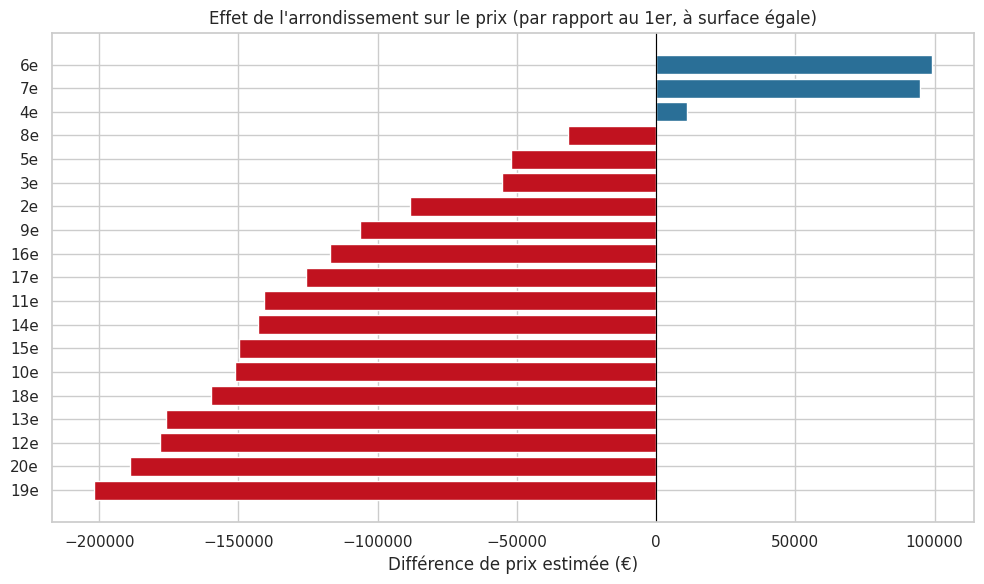

# 🏠 Prédiction du prix des appartements à Paris

Modèle de Machine Learning qui estime le prix de vente d'un appartement parisien à partir de sa **surface**, de son **nombre de pièces** et de son **arrondissement**.

## Contexte

Le prix d'un appartement à Paris varie énormément selon sa taille et sa localisation. L'objectif de ce projet est de construire un modèle simple et explicable, capable de donner une première estimation du prix d'un bien.

## Données

- **48 921 ventes d'appartements** à Paris entre 2018 et 2019
- Source : Demandes de Valeurs Foncières (DVF), jeu de données mis à disposition par la Wild Code School
- Variables utilisées : prix de vente, surface, nombre de pièces, arrondissement

## Outils

Python · Pandas · Scikit-learn · Matplotlib · Seaborn · Jupyter Notebook

## Démarche

1. **Préparation des données** : sélection des appartements, contrôle des valeurs manquantes
2. **Analyse exploratoire** : prix au m² par arrondissement, relation surface/prix, corrélations
3. **Encodage** de l'arrondissement (variable catégorielle) en colonnes binaires
4. **Modélisation** par régression linéaire, avec 80 % des données pour l'entraînement et 20 % pour le test
5. **Évaluation** avec le R² et l'erreur moyenne en euros (MAE)
6. **Interprétation** des coefficients : valeur d'un m², effet de chaque arrondissement

## Résultats clés

| Indicateur | Résultat |
|---|---|
| R² (test) | **0,85** |
| R² (entraînement) | 0,848 |
| Erreur moyenne (MAE) | **environ 92 000 €** |

- Le modèle explique environ **85 %** des écarts de prix entre appartements.
- Scores d'entraînement et de test très proches : le modèle généralise bien, sans surapprentissage.
- Chaque **m² supplémentaire** ajoute en moyenne environ **11 500 €** au prix.
- La **surface** est le facteur le plus déterminant (corrélation de 0,91 avec le prix), suivie du nombre de pièces (0,75).
- À surface égale, l'**arrondissement** fait varier le prix de près de **300 000 €** entre le 6e (le plus cher) et le 19e (le moins cher).
- Le prix médian au m² va d'environ **8 300 €** dans le 19e à plus de **13 500 €** dans le 6e.

## Aperçu





## Limites et pistes d'amélioration

- Avec une erreur moyenne d'environ 92 000 €, le modèle donne une première estimation, pas un prix de vente précis ; il est moins fiable pour les biens de luxe (au-delà de 2 M€).
- Le modèle ignore l'étage, l'état du bien, les extérieurs ou la proximité des transports.
- Pistes : validation croisée, modèles non linéaires (Random Forest, Gradient Boosting), ajout de variables géographiques plus fines et analyse du texte des annonces (NLP).

## Lancer le projet

```bash
pip install pandas scikit-learn matplotlib seaborn jupyter
jupyter notebook prediction_prix_appartements_paris.ipynb
```

Les données sont chargées directement depuis Internet : aucun fichier à télécharger.

## Auteur

**Ahcene Madjour** – Data Analyst
